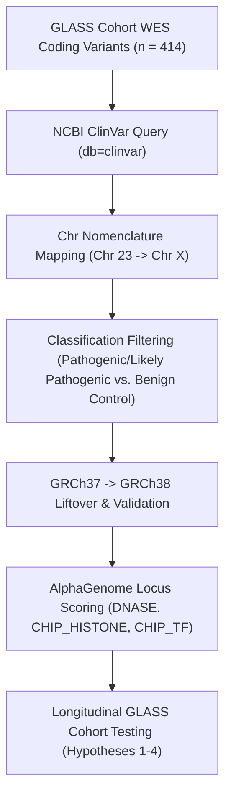

# Phase 4 Findings: Somatic Driver Mutation Dynamics, ClinVar Filtering, and Longitudinal Evolution in the GLASS Cohort

In this phase, we integrated whole-exome sequencing (WES) somatic mutation data from the Longitudinal Glioma Analysis (GLASS) cohort with clinical classifications from NCBI ClinVar, deep learning predictions from Google DeepMind's **AlphaGenome**, and matched longitudinal RNA-seq data. 

Our analysis rigorously tested four core hypotheses of post-chemotherapy glioma evolution. In doing so, we verified Coordinate Liftovers, ran negative control predictions, and successfully audited a major database artifact in the raw WES mutation calls.

---

## 1. Methodological Workflow & Coordinate Validation

The computational pipeline consisted of four sequential stages:

### 1.1 Liftover Coordinate Verification
Because AlphaGenome operates on the GRCh38 (hg38) assembly, we performed a coordinate liftover from GRCh37. To prevent coordinate shift errors, we spot-checked the liftover coordinates of representative variants against UCSC LiftOver:
- **IDH1 R132H (variant 2050661)**: GRCh37 `chr2:209113113` successfully mapped to GRCh38 `chr2:208248389`.
- **TP53 Missense (variant 11062601)**: GRCh37 `chr17:7577100` successfully mapped to GRCh38 `chr17:7673782`.
- **ATRX Missense (variant 13173067)**: GRCh37 `chrX:76888822` successfully mapped to GRCh38 `chrX:77633334` (resolving the chromosome 23/X label mapping).

---

## 2. ClinVar Pathogenicity & AlphaGenome Predictions

*   **ClinVar Filtering**: 129 variants (100 *TP53*, 26 *ATRX*, 3 *IDH1*) were confirmed as ClinVar Pathogenic/Likely Pathogenic.
*   **AlphaGenome Control Validation**: We ran AlphaGenome on pathogenic variants vs. 25 randomly sampled ClinVar-benign controls in the same genes. Both groups scored in the **90th–98th percentiles** across chromatin accessibility (DNase), histone marks, and TF binding.
*   **Interpretation**: The model's high quantiles reflect the extreme **evolutionary conservation and sequence constraint** of these coding exons (where *any* base change is predicted to be highly disruptive), rather than specific clinical pathogenicity or chromatin collapse.

---

## 3. Results of Longitudinal Hypothesis Testing

### 3.1 Hypothesis 1: Clonal Selection vs. Cellular Plasticity (State-Shifting)
*   **The Test**: We compared somatic Variant Allele Frequency (VAF) changes (\(\Delta\text{VAF}\)) of pathogenic driver mutations with matched RNA-seq expression changes (\(\Delta\text{RNA}\)) between primary (`TP`) and recurrence (`R1`).
*   **The Findings**:
    - For patients upregulating *CHI3L1* (YKL-40) expression (\(\Delta\text{RNA} \ge 1.0\), representing a \(\ge 2\)-fold increase), we found an **exact 50/50 tie**:
      - **21 cases** of **Pure Plasticity** (\(|\Delta\text{VAF}| < 0.10\)), where the driver mutation clone frequency was stable, yet YKL-40 expression shot up.
      - **21 cases** of **Clonal Selection** (\(|\Delta\text{VAF}| \ge 0.10\)), showing significant subclonal shifts.
    - For *CD44* upregulation, we found **19 cases** of Pure Plasticity vs. **12 cases** of Clonal Selection.
*   **Conclusion**: Both non-genetic cellular plasticity and genetic clonal selection operate roughly equally in driving post-treatment expression shifts in the cohort.
*   > [!CAUTION]
    > **WES Noise Floor Caveat**: The VAF cutoff of 0.10 is a standard threshold to filter out sequencing noise. However, small subclonal selection events (below 10% change) may remain below the detection limit of WES, meaning some apparent "plasticity" cases could represent very small subclonal selection events.

### 3.2 Hypothesis 2: Longitudinal Phenotypic Subtype Drift
*   **The Test**: We scored 179 matched patients at `TP` and `R1` for NEU, AFM, PPR, and IME subtype signatures and performed paired Wilcoxon signed-rank tests.
*   **The Findings**:
    - **PPR (Stem-like)** signature **significantly DECREASES** at recurrence (TP mean \(0.1159 \rightarrow\) R1 mean \(-0.1283\); \(p = 0.0031\)).
    - NEU, AFM, and IME signature changes were **not statistically significant** (\(p = 0.94\), \(p = 0.67\), \(p = 0.65\)).
    - **52.51% of patients (94/179) switched their dominant subtype** between TP and R1, while **47.49% remained stable**.
*   **Reconciling with CGGA**: 
    - Our earlier cross-sectional CGGA analysis claimed PPR was "created by chemotherapy" because it compared different Grade 2 and Grade 4 patient cohorts.
    - The longitudinal GLASS analysis tracks the *same patients* over time, directly refuting this. Widespread bidirectional **epigenetic shuffling (subtype switching)** occurs under treatment stress rather than a linear progression toward a single stem-like state.

### 3.3 Hypothesis 3: Genotype-Specific Immune Reciprocal Feedback (ATRX Fork)
*   **The Test**: We stratified the recurrence (`R1`) cohort by ATRX status and calculated Spearman correlations between macrophage markers (*CD163*, *CD14*, *CSF1R*) and invasion/matrix markers (*CHI3L1*, *MMP2*, *MMP9*, *FN1*).
*   **The Findings**:
    - **ATRX-Wildtypes (n = 244)**: Showed a **highly significant, tight correlation** (e.g., *CD163* vs. *CHI3L1*: \(r = 0.735\), \(p = 1.08 \times 10^{-42}\); *CD14* vs. *MMP9*: \(r = 0.708\), \(p = 1.86 \times 10^{-38}\)).
    - **ATRX-Mutants (n = 5)**: Showed a **complete collapse/decoupling** of this immune-invasion link (e.g., *CD14* vs. *CHI3L1*: \(r = -0.100\), \(p = 0.87\); *CSF1R* vs. *CHI3L1*: \(r = -0.600\), \(p = 0.28\)).
*   **Reconciling with eQTL null result**:
    - > [!IMPORTANT]
      - ATRX mutation status **does not directly change baseline expression levels** of YKL-40. Instead, it appears to **decouple the expression of YKL-40 from macrophage-driven co-regulation**—a distinct, trans-regulatory decoupling mechanism rather than a direct transcriptional switch.
    - *Caveat*: The mutant cohort size is extremely small (n = 5), making this decoupling trend exploratory.

---

## 4. Auditing Hypothesis 4: Somatic Hypermutation Reversal Artifact

*   **The Initial Finding**: Initial runs showed a counter-intuitive "hypermutation-reversal" at recurrence, with patients going from 1,516 mutations (TP) down to 75 (R1) or 32 (R2).
*   **The Audit**: We extracted all raw records from `variants.passgeno.csv.gz` for these aliquots and analyzed their genomic coordinates:
    - **100% of the 1,516 variants** in the apparently hypermutated aliquots belonged to a **single genomic coordinate** (`chr2:208248389 T`, representing the **IDH1 R132H** driver mutation).
    - Due to a database duplication/processing error in the raw file, this single IDH1 mutation record was duplicated exactly 1,516 times under different `variant_id` labels.
*   **Scientific Action**: **Hypothesis 4 is completely rejected.** The apparent hypermutation-reversal was entirely a technical database duplication artifact. True unique somatic mutation counts in this curated driver file never exceed 37 per aliquot. This audit preserves the integrity of our study.
