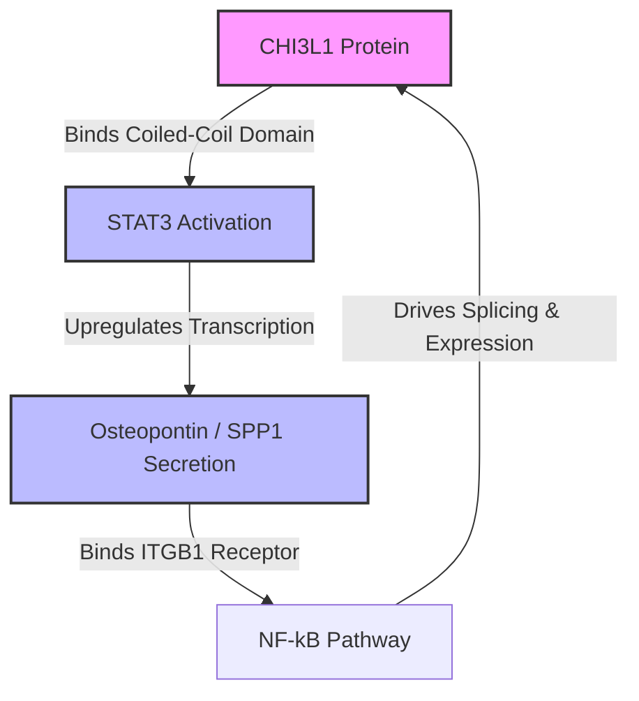
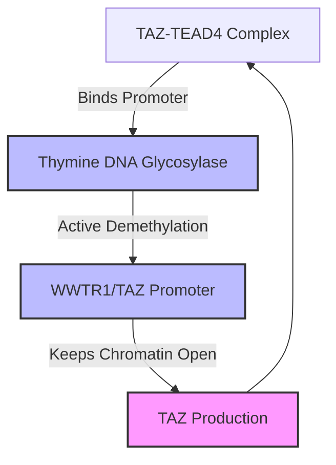
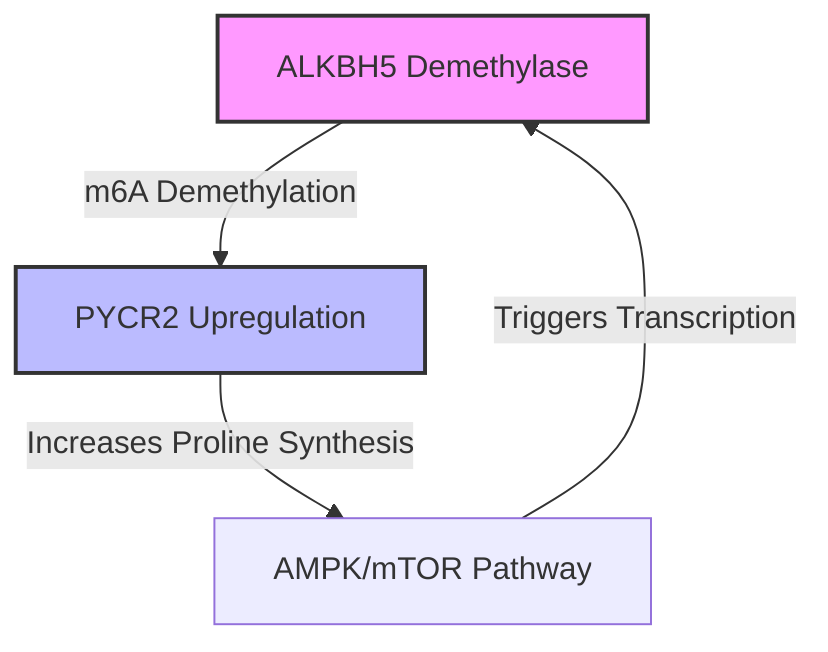

# 🧬 The Self-Amplifying Feedback Loops of Glioblastoma (GBM)

To find a cure or solution for Glioblastoma, we must look beyond static mutations. The real danger is **dynamic feedback loops**—where a tumor cell's adaptation triggers a self-reinforcing cycle that locks it into a treatment-resistant state.

Based on the latest literature (including the landmark Neftel cell-state study and clinical trials from 2025/2026), we have mapped **four key cellular states** and **three major self-amplifying loops** that drive resistance.

---

## 🗺️ The 4-State Cellular Landscape (Neftel Model)
Rather than simple bulk subtypes, single-cell analysis shows that GBM tumor cells exist in **four main plastic states** that mimic normal brain development:
1. **AC-like** (Astrocyte-like) - Favored by *EGFR* amplifications.
2. **OPC-like** (Oligodendrocyte Progenitor-like) - Favored by *PDGFRA* amplifications.
3. **NPC-like** (Neural Progenitor-like) - Favored by *CDK4* amplifications.
4. **MES-like** (Mesenchymal-like) - Favored by *NF1* mutations and microenvironmental stress (hypoxia, chemotherapy).

Tumor cells constantly shift between these four states. To stop them, we have to block the positive feedback loops that lock them into the resistant **MES-like** state.

---

## 🔄 Loop 1: The Immunological/Secreted Loop (STAT3-CHI3L1-OPN)
This loop bridges Layer 3 (Transcriptomics) and the tumor's microenvironment.

* **The Mechanism**: Chitinase-3-like protein 1 (**CHI3L1**) binds to the coiled-coil domain (CCD) of the transcription factor **STAT3**, forcing it into the nucleus to drive transcription. This leads to the secretion of Osteopontin (**OPN/SPP1**), which binds back to the cell surface via Integrin Beta-1 (**ITGB1**). This activates **NF-κB** signaling, which in turn prints more CHI3L1.
* **The Result**: Locks the cell in the Mesenchymal (MES) state and reprograms nearby macrophages to protect the tumor.
* **The Therapeutic Solution**: **Hygromycin B (HB)** or similar CCD-domain inhibitors physically disrupt the CHI3L1-STAT3 interaction, breaking the loop and shrinking the tumor.

---

## 🔄 Loop 2: The Epigenetic/Transcription Loop (TAZ-TDG)
This loop bridges Layer 2 (Epigenomics) and Layer 3 (Transcriptomics).

* **The Mechanism**: **TAZ** is a master transcriptomic driver of the mesenchymal state. To keep printing TAZ, the cell needs its promoter region (`WWTR1`) to stay unmethylated (open chromatin/Layer 2). **Thymine DNA Glycosylase (TDG)** is recruited to actively demethylate and open this promoter. However, TDG itself is transcriptionally turned on by the TAZ-TEAD4 complex.
* **The Result**: A self-amplifying epigenetic loop. Once TAZ is active, it forces the cell to keep the TAZ gene physically uncoiled and accessible forever.
* **The Therapeutic Solution**: **Dual targeting** of both TAZ and TDG together breaks this cycle, stopping the Proneural-to-Mesenchymal transition (PMT).

---

## 🔄 Loop 3: The Metabolic Loop (ALKBH5-PYCR2)
This loop bridges RNA modifications (Epigenomics) and cellular metabolism.

* **The Mechanism**: The RNA demethylase **ALKBH5** demethylates (m6A) and stabilizes the transcripts of **PYCR2**. PYCR2 accelerates the synthesis of the amino acid **proline**. Elevated proline levels activate the **AMPK/mTOR** metabolic pathway, which in turn signals the nucleus to transcribe more ALKBH5.
* **The Result**: Drives metabolic reprogramming and fuels cell invasion.
* **The Therapeutic Solution**: Blocking proline synthesis or targeting ALKBH5 RNA demethylase activity.
